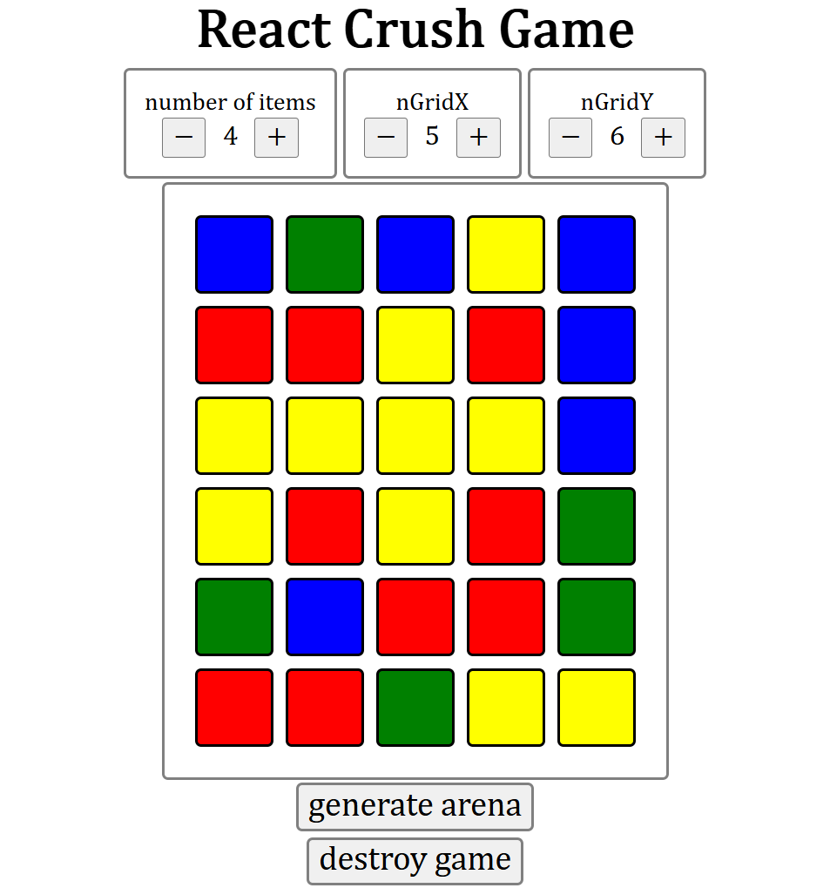

## Crush Game in React with JavaScript

## Progress
 ✅ game setup is functional - one can calibrate the dimensions of the grid with different number of items to match  
 🚧 select items from the grid  
 🚧 mark grid elements that hold three or more identical items in a row, either horizontally or vertically

## How to Run
 - open project folder in Visual Studio Code, open terminal
 - `npm i vite` and `npm run start`
 - click provided link with localhost address

## Environment
initial setup in single html file with text editor  
later divided code into multiple files, used `npx nano-react-app` as template  
install Node.js LTM, verify that it is fine - `node --version` and `npm --version`  
might need to run as well - `Set-ExecutionPolicy -Scope CurrentUser -ExecutionPolicy unrestricted`
